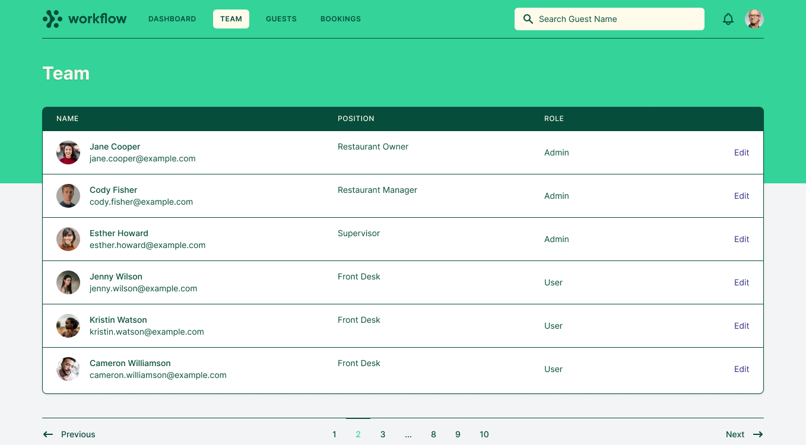
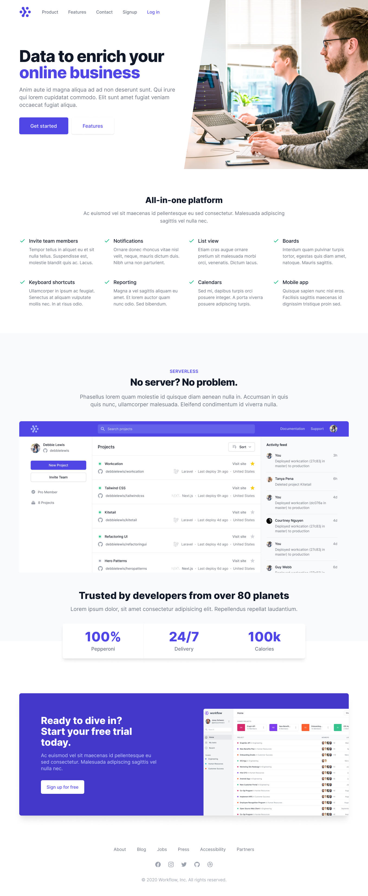
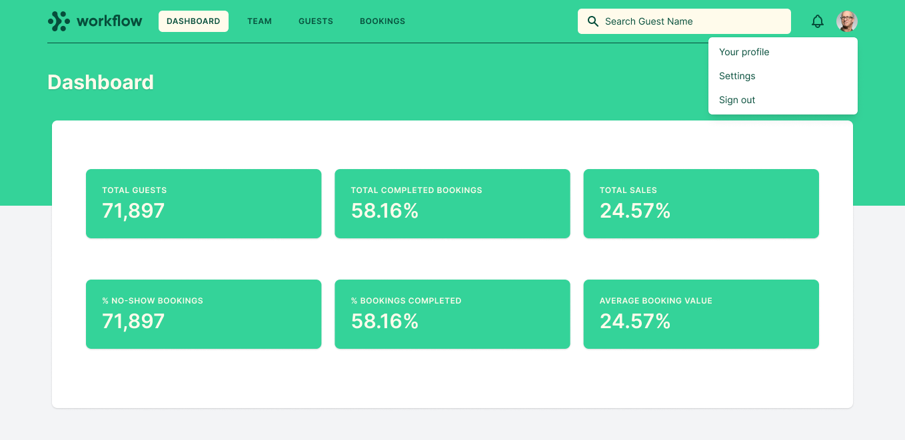

# Bookler

[Click To See Live Site](http://tailwind-ms3-new.herokuapp.com/)

Bookler is a website and app designed for restaurants that deal with reservations and require a CRM to manage manual bookings as they move away from pen and paper diary management (which is still prevalent across the industry). 
A key feature of the app is it's guest profiles which enable the restaurant to keep information in one place to deliver the best guest experience possible.

[](https://sreninc.github.io/tailwind-ms3/)

## CONTENTS
1. [User Stories](#user-stories)
1. [Design and UX](#design-and-ux)
    - Mockups & Wireframes
1. [Website Pages and Features](#website-pages-and-features)
    - Common Features
    - Hompage
    - Features
    - Contact
    - Signup
1. [App Pages and Features](#app-pages-and-features)
    - Common Features
    - Dashboard
    - Team
        - Add User
        - Edit User
        - Delete User
    - Guests
        - Add Guest
        - Edit Guest
        - Delete Guest
    - Bookings
        - Add Bookings
        - Edit Booking
        - Delete Booking
1. [Database Schema](#database-schema)
1. [Testing](#testing)
1. [Bug and Issues Log](#bug-and-issues-log)
1. [Potential Future Features](#potential-future-features)
1. [Deployment](#deployment)
    - [GitHub Pages](#github-pages)
    - [Forking the GitHub Repository](#forking-the-github-repository)
    - [Making a Local Clone](#making-a-local-clone)
1. [Credits & Attribution](#credits-and-attributions)


***

## Project Stories

### User Stories
As a user I want to...
- Sign up to the service to access software for my restaurant.
- Manage my team and their access levels within the software.
- Created, Update, Read and Delete Guests.
- Create, Update, Read and Delete bookings.
- Be able to add information for guests to improve their service.

### Business Stories
As the website owner I want to...
- Get website visitors in the target market to sign up to the paid service.
- Get website visitors in the target market who are unsure of the service or who have questions to contact the website owner.

***

## Design and UX
The design and UX is based on my ~6 years of experience working in Restaurant Management as well as research on best practice by SAAS companies in the restaurant industry market. I chose TailwindCSS as the design system for the project because of it's focus on utilities over components, which in my opinion makes it a superior design system to Bootstrap. The great flexibility provided by Tailwind utilities gives the ability to create bespoke designs with little to no alterations via CSS files.

I choose the colour scheme based off strong greens out of personal preference of a love of restaurants that use natural plants to design an intimate dining experience. While green is the primary colour it is used in accents throught with a preference given to whites and greys which serves to increase the impact of the green brand colour. refactorUI.com was a great resource for looking at how to improve layouts with small changes which guided how the brand colour was used. 

Website
The website is built using a number of premium tailwindcss components. The aim of the website design is to drive the user to sign up as this is how the website owner will generate revenue (caveated that a future feature would be having a signup option that takes payment, this is out of scope for this particular project). Screenshots of the product are used throughout the website in addition to relevant icons and descriptions to display benefit to the user who is most likely looking for a solution to manage their bookings and guests better.


App
The app pages were designed as much as possible to function just as well on mobile as they do on desktop. This entailed some custom css/html setups for tables to turn them into card like components on smaller screens. I think this worked quite well on the guest and bookings pages in particular. 

Pagination was a difficult one with this project as the recommended pagination tool with flask doesn't behave well with other design systems. Implementing the desired design required manipulation in JS once the pagination was generated. After much work on getting the design right it generates nicely and I'm quite happy with how it turned out.

In the detail pages I decided to group fields together and give the section headers to help explain the purpose of the section but to also allow me to include additional items that aren't 100% necessary. An example of this would be the Stats section on the guest detail pages which gives some statistics on the particular guest. Not a necessary field for day to day work in a restaurant but very useful when a manager/owner is looking at how valuable a guest is to the restaurant.


### Website Mockups

The below image links to figma design file for the website side of the application.
[](https://www.figma.com/file/PcCqhJjJ7vCxE9Nd8rGvp9/MS3?node-id=4%3A714)

The below image links to figma design file for the app side of the application.
[](https://www.figma.com/file/PcCqhJjJ7vCxE9Nd8rGvp9/MS3?node-id=12%3A3356)

***

## Website Pages and Features
1. All pages on the website have access to a login form in the header and footer navigation. When clicked it opens a modal centered on the screen. It has a number of responses based on the users input:
    - Correct email and password - Logs user in and loads Dashboard
    - Incorrect email or password - Loads the homepage with log in modal open containing an error message.
    - Email doesn't exist - Loads the homepage with login modal open containing an error message directing user to signup.

### HOMEPAGE
The purpose of this page is to get the user to signup or failing that to look at the software in more detail on the features page.

### FEATURES
The purpose of this page is to get the user to signup. It contains two hero sections for primary software use cases which are followed by 6 tiles detailing additional important features.

### CONTACT
The website visitor can send a message to the website owner if they want further details on the software or support if an existing user.

N.B. As a demo the number and email are fake. The send message also only sends to the website creators personal address.

### SIGNUP
The purpose of this page is to get the user to signup. If the email doesn't exist in the users db a new business will be created and a new user based on the signup details. If the email already exists the user will be redirected back to the signup page with a message informing them to login rather than signup.

## App Pages and Features
All pages of the app have a search bar in the top navigation with placeholder text to search guests. Users can search by first name, last name, mobile or email in this search bar. However it should be noted that it is mongodb's basic search and not elastic search. The main reason for pointing this out is that it will search for close to exact database entries and won't generally return similar results as you would expect in search engines.

### DASHBOARD
This page shows the restaurant (user) key statistics about their performance based on bookings and guests within Bookler. 
- Total Guests: The count of total guests created by the restaurant
- Total Bookings: The count of total bookings created by the restaurant
- Total Sales: The sum of the value of bookings that are marked as "Completed"
- % No-Shows: The count of bookings marked "No-Show" divided by the count of all other bookings.
- % Completed: The count of booking marked "Completed" divided by the count of all other bookings.
- Avg. Booking Value: Total Sales / Count of bookings marked "Completed"

### TEAM
This is the page where the account managers it's authorized users, their details and access level. If the user is an admin they will see delete and edit options across all pages. If not an admin the user won't see delete options on any pages and they won't be able to edit team members.

N.B. The original account creator is not able to be deleted from the team section. In addition the logged in user cannot delete themselves.

There are 3 functions available from the team page:
1. Add Team Member
1. Edit Team Member
1. Edit Team Member > Delete Team Member

### GUESTS
This is the page where the account manages their guests. This is a primary page for the user and should be considered mission critical. On this page the user can see their guests listed alphabetically, paginated across pages as required with key information on each guest listed. 

There are 2 functions available from the team page:
1. Add Guest
1. Edit Guest

### GUEST DETAIL AKA Edit Guest
This page is the full guest profile. It contains 4 sections covering important information any restaurant would need on it's guests.
1. Personal information: THis section contains contact information for the guest as well as some useful marketing information.
1. Notes: This section contains 3 textareas for notes that ensure an excellent guest experience is possible. 
1. Stats: This section contains stats that are exactly the same as the dashboard statistics with the exception of total guests being replaced with Guest Age. A useful metric when evaluating top guests for a restaurant.
1. Bookings: This section mirrors the main bookings page but is filtered to just the guests bookings ordered by date.

### BOOKINGS
This page is where the restaurant would check their bookings for the day. As they will most frequently be checking the current days bookings the page defaults to the current date. From this page the user can filter by date and/or by booking status to see the bookings they need. From there they may edit bookings to update details. 

It should be noted that there is deliberately no pagination on this page. This is because is it incredibly unlikely for a restaurant to have such an amount of bookings that it would cause the page to load and also to allow them to ctrl+f all bookings on a day should they need to do so for some reason. To back up this decision, Milano on Dawson St. in Dublin (one of Ireland's busiest restaurants) will not have more than 300 bookings on their busiest day of the year).

### BOOKING DETAIL
In this page the user can update details of the booking and / or the guests notes. They aren't able to edit the guest details on this page which is a deliberate decision. If the booking has been made under the wrong guest then they have the option to delete this booking and create a new booking for the correct guest. The delete option will show to any user that is an admin. 

***

## Database Schema

The MongoDB database is structured as follows:
- restaurant_bookings
    - bookings
        - _id
        - client_id [links booking to client]
        - date
        - time
        - people
        - status
        - value
        - rating
        - account_id [links booking to account]
        - created_by
        - created_date
        - updated_by
        - updated_date
    - business
        - _id
        - email
        - name
    - clients
        - _id
        - first_name
        - last_name
        - email
        - mobile
        - marketing_consent
        - rating
        - dob
        - bookings
        - bookings_completed
        - value
        - notes_service
        - notes_kitchen
        - notes_allergies
        - account_id [links client to account]
        - created_by
        - created_date
        - updated_by
        - updated_date
    - users
        - _id
        - email
        - password
        - name
        - access
        - account_holder
        - account_id [links user to account]
        - created_by
        - created_date
        - updated_by
        - updated_date

***

## Testing
The same testing checklist was used to check each page throughout the website. A checklist unique to each feature was used to 

- [ ] All page content loads correctly
- [ ] Passes lighthouse tests
- [ ] No lorem ipsum or spelling errors
- [ ] Page renders correctly on all inspector screen sizes
- [ ] Hover states and CTA clicks present and correct
- [ ] Page passes HTML, CSS and JS linters
- [ ] Links operate as expected
- [ ] No console errors

### Homepage
Ensure the video can be played easily on all screen sizes.

[W3C CSS Validator]() |
[W3C Markup Validator](https://validator.w3.org/nu/?doc=https%3A%2F%2Ftailwind-ms3-new.herokuapp.com%2F) |
[Lighthouse]() |
[JSLint.org]()

### FEATURES

[W3C CSS Validator]() |
[W3C Markup Validator](https://validator.w3.org/nu/?doc=https%3A%2F%2Ftailwind-ms3-new.herokuapp.com%2Ffeatures) |
[Lighthouse]() |
[JSLint.org]()

### CONTACT

[W3C CSS Validator]() |
[W3C Markup Validator](https://validator.w3.org/nu/?doc=https%3A%2F%2Ftailwind-ms3-new.herokuapp.com%2Fcontact) |
[Lighthouse]() |
[JSLint.org]()

### SIGNUP
I did not add a title to the quote section as it does not require one. 

[W3C CSS Validator]() |
[W3C Markup Validator](https://validator.w3.org/nu/?doc=https%3A%2F%2F8080-indigo-dog-2g4nj8u2.ws-eu08.gitpod.io%2Fsignup) |
[Lighthouse]() |
[JSLint.org]()

## App Pages and Features

### DASHBOARD
Markup Passed - Not linkable due to page being signin only
JS Passed

[x] - Large Screen
[x] - Medium Screen
[x] - Small Screen

### TEAM
Markup Passed - Not linkable due to page being signin only
JS Passed

[x] - Large Screen
[x] - Medium Screen
[x] - Small Screen

### TEAM DETAIL
Markup Passed - Not linkable due to page being signin only
JS Passed

[x] - Large Screen
[x] - Medium Screen
[x] - Small Screen

### ADD TEAM MEMBER
Markup Passed - Not linkable due to page being signin only
JS Passed

[x] - Large Screen
[x] - Medium Screen
[x] - Small Screen

### GUESTS
Markup Passed - Not linkable due to page being signin only
JS Passed

[x] - Large Screen
[x] - Medium Screen
[x] - Small Screen

### GUEST DETAIL
Markup Passed - Not linkable due to page being signin only
JS Passed

[x] - Large Screen
[x] - Medium Screen
[x] - Small Screen

### ADD GUEST
Markup Passed - Not linkable due to page being signin only
JS Passed

[x] - Large Screen
[x] - Medium Screen
[x] - Small Screen

### BOOKINGS
Markup Passed - Not linkable due to page being signin only
JS Passed

[x] - Large Screen
[x] - Medium Screen
[x] - Small Screen

### BOOKING DETAIL
Markup Passed - Not linkable due to page being signin only
JS Passed

[x] - Large Screen
[x] - Medium Screen
[x] - Small Screen

### ADD BOOKING
Markup Passed - Not linkable due to page being signin only
JS Passed

JS Passed

[x] - Large Screen
[x] - Medium Screen
[] - Small Screen

Small screen was not generating correctly on smaller screens and was updated to show correctly.

***

## Bug and Issues Log
All bugs and issues are logged under the issues tab of github linked [here](https://github.com/sreninc/tailwind-ms3/issues)

Bugs were mostly identified during usability testing referenced above. Some other issues during development were dealt with during build rather than logging an issue ex post facto.

***

## Potential Future Features
- Photo upload for team and guests to fill profile pictures. For guest pictures in general this allows the restaurant to identify repeat clients as they walk in the door providing an increased guest experience.
- Enable sms and email to be sent to guests to leave reviews after bookings that populate directly in the software. 
- Have SMS and Email marketing options in the product to allow the restaurant owner to generate new bookings as well as manage existing ones.
- Create a reports section with reports to help restaurants better manage their system.
- Add a booking widget that restaurant owners can use on their websites / social media profiles etc to allow their guests to book directly into the software.
- Add a pos element where restaurants can manage their menu items and process sales through the system. 
- Improve the app search function to have elastic search.

***

## Deployment

### GitHub Pages

The project was deployed to GitHub Pages using the following steps...

1. Log in to GitHub and locate the [GitHub Repository](https://github.com/sreninc/financial-freedom)
2. At the top of the Repository (not top of page), locate the "Settings" Button on the menu.
    - Alternatively Click [Here](https://raw.githubusercontent.com/) for a GIF demonstrating the process starting from Step 2.
3. Scroll down the Settings page until you locate the "GitHub Pages" Section.
4. Under "Source", click the dropdown called "None" and select "Master Branch".
5. The page will automatically refresh.
6. Scroll back down through the page to locate the now published site [link](https://sreninc.github.io/financial-freedom/) in the "GitHub Pages" section.

### Forking the GitHub Repository

By forking the GitHub Repository we make a copy of the original repository on our GitHub account to view and/or make changes without affecting the original repository by using the following steps...

1. Log in to GitHub and locate the [GitHub Repository](https://github.com/sreninc/financial-dreedom)
2. At the top of the Repository (not top of page) just above the "Settings" Button on the menu, locate the "Fork" Button.
3. You should now have a copy of the original repository in your GitHub account.

### Making a Local Clone

1. Log in to GitHub and locate the [GitHub Repository](https://github.com/sreninc/financial-freedom)
2. Under the repository name, click the "Code" button and a dropdown menu will appear.
3. To clone the repository using HTTPS, under "Clone with HTTPS", copy the link.
4. Open Git Bash
5. Change the current working directory to the location where you want the cloned directory to be made.
6. Type `git clone`, and then paste the URL you copied in Step 3.

```
$ git clone https://github.com/YOUR-USERNAME/YOUR-REPOSITORY
```

7. Press Enter. Your local clone will be created.

```
$ git clone https://github.com/YOUR-USERNAME/YOUR-REPOSITORY
> Cloning into `CI-Clone`...
> remote: Counting objects: 10, done.
> remote: Compressing objects: 100% (8/8), done.
> remove: Total 10 (delta 1), reused 10 (delta 1)
> Unpacking objects: 100% (10/10), done.
```

Click [Here](https://help.github.com/en/github/creating-cloning-and-archiving-repositories/cloning-a-repository#cloning-a-repository-to-github-desktop) to retrieve pictures for some of the buttons and more detailed explanations of the above process.

9. Create an env.py file with the below content, replaced with your details after setting up your MongoDB collection and using your favourite key generator.

Click [Here](https://testdriven.io/blog/flask-htmx-tailwind) for information on setting up TailwindCSS successfully including purging css files for production.

```
import os

os.environ.setdefault("IP", "0.0.0.0")
os.environ.setdefault("PORT", "5000")
os.environ.setdefault("SECRET_KEY", {your_secret_key})
os.environ.setdefault("MONGO_URI", {your_db_uri}")
os.environ.setdefault("MONGO_DBNAME", {your_db_name})
```

10. Install all requirements from requirements.txt file

```
pip3 install -r requirements.txt
```

***

## Credits and Attributions

1. TailwindCSS for their wealth of components and a best in class CSS system that is used on every single page of the website and app.
1. Unsplash for their library of images used in hero images.
1. My Mentor, Maranatha Ilesanmi,  for continuous helpful feedback and guidance.
1. Fellow Code Institute students for their feedback and suggestions.
1. Stackoverflow and W3C for their wealth of helpful information on coding which assisted me in developing the code.
1. Heroicons, the perfect companion to TailwindCSS with quality icons used throughout the website and app.
1. Timer Function on app searches: https://stackoverflow.com/questions/4220126/run-javascript-function-when-user-finishes-typing-instead-of-on-key-up
1. Creating a textarea that auto-resizes: https://stackoverflow.com/questions/454202/creating-a-textarea-with-auto-resize
1. TailwindCSS & Flask Guide: https://testdriven.io/blog/flask-htmx-tailwind
1. refactoringUI.com for their insights in improving design (as much as I was able to follow it!)